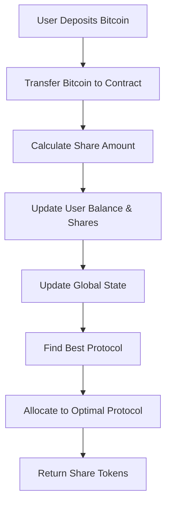
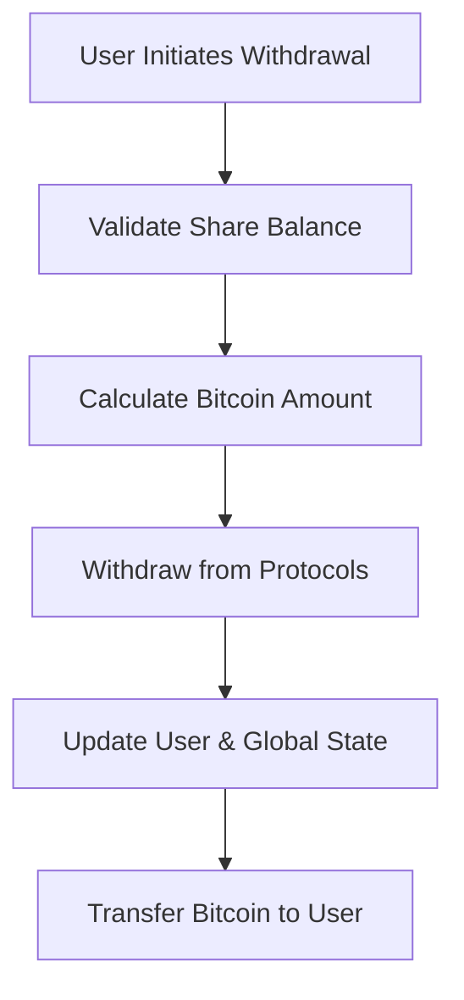
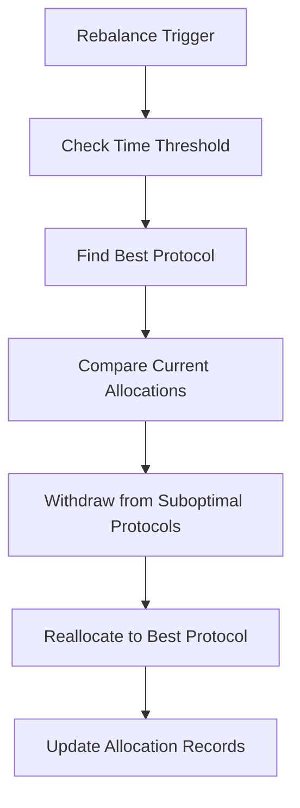

# BitcoinMax Yield Optimizer Protocol

## Overview

BitcoinMax is a sophisticated DeFi yield optimizer built on Stacks Layer 2 that automatically allocates user Bitcoin deposits across multiple yield-generating protocols to maximize returns. The system continuously monitors protocol performance, automatically rebalances funds to the highest yielding opportunities, and provides users with tokenized shares representing their proportional ownership of the optimized yield pool.

## Key Features

- **Automated Yield Farming**: Intelligently distributes Bitcoin across multiple high-yield protocols
- **Dynamic Rebalancing**: Continuously monitors and reallocates funds to optimize returns
- **Tokenized Share System**: Seamless deposits and withdrawals through share-based accounting
- **Permissionless Integration**: Add new protocols with governance controls
- **Gas-Optimized Operations**: Configurable thresholds to minimize transaction costs
- **Layer 2 Compliance**: Full Bitcoin Layer 2 security standards and compliance

## System Architecture

### Contract Architecture

The BitcoinMax protocol consists of a single smart contract with modular components:

```
┌─────────────────────────────────────────────────────────────┐
│                    BitcoinMax Core Contract                 │
├─────────────────────────────────────────────────────────────┤
│ User Management       │ Protocol Registry    │ Governance   │
│ - User deposits       │ - Protocol addresses │ - Owner mgmt │
│ - Share tracking      │ - Yield rates        │ - Admin ops  │
│ - Balance queries     │ - Allocation data    │ - Parameters │
├─────────────────────────────────────────────────────────────┤
│ Yield Optimization Engine                                   │
│ - Best protocol finder                                      │
│ - Automated rebalancing                                     │
│ - Allocation strategies                                     │
├─────────────────────────────────────────────────────────────┤
│ Core Functions                                              │
│ - Deposit/Withdraw                                          │
│ - Share calculations                                        │
│ - Protocol interactions                                     │
└─────────────────────────────────────────────────────────────┘
```

### Data Storage Structure

#### User Data

- **user-deposits**: Maps user principals to their total Bitcoin deposits
- **user-shares**: Maps user principals to their share ownership

#### Protocol Registry

- **protocol-addresses**: Maps protocol names to contract addresses
- **protocol-yields**: Maps protocol names to current APY (basis points)
- **protocol-allocations**: Maps protocol names to allocated amounts
- **protocol-enabled**: Maps protocol names to active status
- **protocol-registry**: Maps indices to protocol names for iteration

#### Global State

- **total-deposits**: Total Bitcoin deposited across all users
- **total-shares**: Total shares in circulation
- **contract-owner**: Current contract administrator
- **rebalance-threshold**: Minimum yield difference for rebalancing (basis points)

## Data Flow

### Deposit Flow



### Withdrawal Flow



### Rebalancing Flow



## Core Functions

### User Functions

#### `deposit(amount: uint)`

Deposits Bitcoin into the yield optimizer and mints corresponding shares.

**Parameters:**

- `amount`: Bitcoin amount to deposit (in satoshis)

**Returns:**

- Share amount minted

**Process:**

1. Validates deposit amount > 0
2. Transfers Bitcoin from user to contract
3. Calculates shares based on current share price
4. Updates user and global balances
5. Allocates deposit to optimal protocol

#### `withdraw(share-amount: uint)`

Burns shares and withdraws corresponding Bitcoin amount.

**Parameters:**

- `share-amount`: Number of shares to burn

**Returns:**

- Success confirmation

**Process:**

1. Validates sufficient share balance
2. Calculates Bitcoin withdrawal amount
3. Withdraws from protocols as needed
4. Updates balances and transfers Bitcoin to user

### Administrative Functions

#### `add-protocol(protocol-name, protocol-address, initial-yield)`

Adds a new yield protocol to the optimization engine.

**Parameters:**

- `protocol-name`: Unique identifier for the protocol
- `protocol-address`: Contract address of the yield protocol
- `initial-yield`: Initial APY in basis points

#### `update-protocol-yield(protocol-name, new-yield)`

Updates yield information for a registered protocol.

#### `rebalance()`

Triggers intelligent rebalancing of funds across protocols.

### Query Functions

#### `get-user-balance(user)`

Returns the total Bitcoin deposit balance for a user.

#### `get-share-value()`

Calculates the current value of one share (with 6 decimal precision).

#### `get-best-protocol()`

Returns the currently highest yielding protocol.

## Share Price Mechanism

The share price is calculated using the formula:

```
Share Price = Total Deposits / Total Shares
```

- Initial share price: 1.0 (with 6 decimal places = 1,000,000)
- Share price increases as yields are earned and compounded
- Users always withdraw proportional to their share of the total pool

## Security Features

### Access Control

- **Owner-only functions**: Protocol management, yield updates, ownership transfer
- **Principal validation**: Prevents zero address and invalid contract interactions
- **Transfer validation**: Ensures ownership transfer to valid principals

### Operational Security

- **Rebalancing throttle**: Minimum 100 blocks between rebalances
- **Yield limits**: Maximum 100% APY validation
- **Amount validation**: Prevents zero or negative amounts
- **Protocol existence checks**: Validates protocols before operations

### Error Handling

Comprehensive error constants for all failure scenarios:

- `ERR_UNAUTHORIZED`: Access control violations
- `ERR_INSUFFICIENT_BALANCE`: Balance validation failures
- `ERR_TRANSFER_FAILED`: Token transfer failures
- `ERR_PROTOCOL_NOT_FOUND`: Invalid protocol references

## Protocol Integration

### Yield Protocol Trait

External protocols must implement the `yield-protocol-trait`:

```clarity
(define-trait yield-protocol-trait (
  (deposit (uint principal) (response bool uint))
  (withdraw (uint principal) (response bool uint))
  (get-balance (principal) (response uint uint))
))
```

### Integration Process

1. Deploy yield protocol implementing the required trait
2. Admin calls `add-protocol` with protocol details
3. System automatically includes protocol in optimization engine
4. Yields are updated manually or through oracle integration

## Usage Examples

### Basic Deposit

```clarity
;; Deposit 1000000 satoshis (0.01 BTC)
(contract-call? .bitcoinmax-yield-optimizer deposit u1000000)
```

### Withdrawal

```clarity
;; Withdraw 500 shares
(contract-call? .bitcoinmax-yield-optimizer withdraw u500)
```

### Check Balance

```clarity
;; Get user's Bitcoin balance
(contract-call? .bitcoinmax-yield-optimizer get-user-balance tx-sender)
```

## Limitations & Considerations

1. **Manual Yield Updates**: Protocol yields must be updated manually by admin
2. **Simplified Protocol Integration**: Current implementation uses allocation tracking rather than direct protocol calls
3. **Rebalancing Threshold**: 100-block minimum between rebalances to prevent spam
4. **Protocol Limit**: Supports up to 5 protocols in current implementation

## Future Enhancements

- Oracle integration for automated yield updates
- Dynamic protocol limit expansion
- Advanced rebalancing strategies (time-weighted, volume-based)
- Emergency pause functionality
- Multi-signature governance
- Automated compounding mechanisms

## License

This project is provided as-is for educational and development purposes. Please ensure proper security auditing before mainnet deployment.
